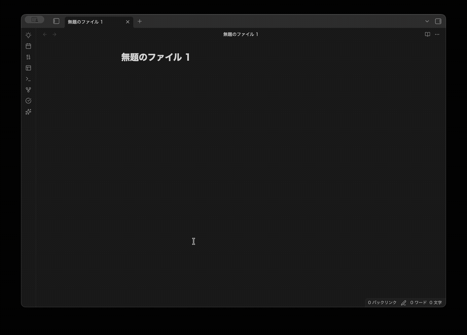

# AI CLI Runner

[Obsidian](https://obsidian.md) のプラグインで、Claude Code・aider などの AI CLI ツールを Obsidian 内のターミナルパネルで直接実行できます。

> **対応プラットフォーム:** macOS のみ（Apple Silicon・Intel 両対応）。Windows/Linux は今後対応予定。

**[English](../README.md) · [中文](README.zh.md) · [Español](README.es.md) · [Français](README.fr.md)**

---

## 機能

- 組み込みターミナルパネル（xterm.js + node-pty）— 外部ターミナル不要
- Claude Code・aider・GitHub Copilot CLI、またはカスタム CLI ツールを起動
- ツールセレクター + 起動/停止ボタンのコンパクトなツールバー
- ターミナルの分割表示（複数パネルを横並びで開く）
- Obsidian のファイルエクスプローラーからターミナルへのドラッグ&ドロップ（ファイルパスを挿入）
- アクティブなノートのフォルダに作業ディレクトリを自動設定
- Kitty キーボードプロトコル対応（Claude Code の TUI に必要）
- 完全カスタマイズ可能：設定画面でツールの追加・編集・削除が可能

## 動作要件

- macOS（Apple Silicon または Intel）
- 使用したい CLI ツールがシェルの PATH に通っていること（`.zshrc` / `.zprofile`）

## インストール

### BRAT を使う方法（推奨）

[BRAT](https://github.com/TfTHacker/obsidian42-brat) を使うと、コミュニティストア外のプラグインを簡単にインストール・自動更新できます。

1. Obsidian コミュニティストアから **BRAT** プラグインをインストール
2. BRAT 設定 → **Add Beta plugin** を選択
3. `KentaMaeda0916/obsidian-ai-cli-runner` を入力
4. **設定 → コミュニティプラグイン** でプラグインを有効化
5. ▶ をクリックしてツールを起動 — 初回起動時に必要なネイティブバイナリが自動ダウンロードされます

### 手動インストール

1. [Releases](https://github.com/KentaMaeda0916/obsidian-ai-cli-runner/releases) ページから `obsidian-ai-cli-runner.zip` をダウンロード
2. zip を展開し、`obsidian-ai-cli-runner` フォルダを `<vault>/.obsidian/plugins/` に移動
3. Obsidian を再読み込みし、**設定 → コミュニティプラグイン** でプラグインを有効化
4. ▶ をクリックしてツールを起動 — 初回起動時に必要なネイティブバイナリが自動ダウンロードされます

> コード署名の手順や quarantine の解除は不要です。

## 使い方

| 操作 | 方法 |
|------|------|
| ターミナルパネルを開く | 左サイドバーの ✨ アイコンをクリック、またはコマンドパレット → **Open AI CLI panel** |
| ツールを起動 | ドロップダウンから選択 → ▶ をクリック |
| 実行中のツールを停止 | ■ をクリック |
| ターミナルを分割 | 分割カラムアイコンをクリック |
| パネルを閉じる | ゴミ箱アイコンをクリック |
| ファイルパスを挿入 | ファイルエクスプローラーからターミナルにファイルをドラッグ |

## 設定

**設定 → AI CLI Runner** から以下を設定できます：

- 新規パネル作成時に開くデフォルトツール
- カスタムツールの追加（任意の CLI コマンド + 引数）
- 既存ツールの編集・削除

### カスタムツールの追加例

| フィールド | 値 |
|-----------|-----|
| 表示名 | `My Tool` |
| コマンド | `mytool` |
| 引数 | `--flag value` |

## 仕組み

このプラグインは `node-pty` を通じて PTY（疑似ターミナル）を組み込み、`xterm.js` でレンダリングします。各ツールはログインシェル（`$SHELL -i -l -c <command>`）経由で起動されるため、シェル設定（PATH・エイリアスなど）がそのまま利用できます。

初回起動時、小さなネイティブバイナリ（`pty.node`）がプラグインの GitHub Releases からダウンロードされます。これにより、バイナリをバンドルした場合に発生する macOS Gatekeeper の問題を回避でき、ダウンロードは一度だけです。

## トラブルシューティング

**初回起動時に "Failed to download pty binary" と表示される**
- インターネット接続を確認してください
- 初回のみ GitHub から小さなネイティブバイナリをダウンロードします

**"Failed to start \<command\>" と表示される**
- コマンドがインストールされているか確認：Terminal で `which <command>` を実行
- `.zshrc` または `.zprofile` で PATH に追加されているか確認

**Shift+Enter が効かない**
- プラグインは Shift+Enter に Kitty キーボードプロトコルのエスケープシーケンスを送信します。対応バージョンの CLI ツールを使用してください。

## ライセンス

MIT — [LICENSE](../LICENSE) を参照
